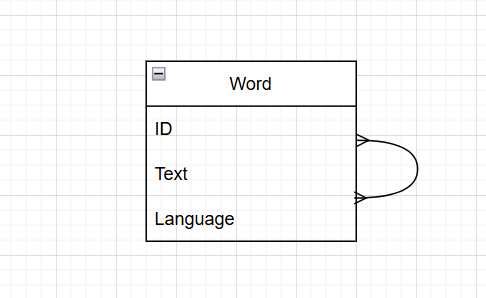
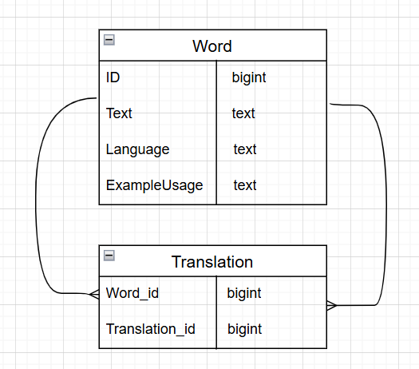

# go gqlgen app

## How to run project?

Simply use

``docker compose up ``

## Database models
 I chose to implement translations database as a single table Word
 with self relation many to many

Later I further optimized it to two tables:
- Word table - stores unique words
- Translation table - stores translations between words

