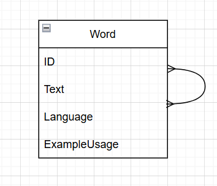

# go gqlgen app

## How to run project?

Simply use
``docker compose up ``

## How to run test?

Use
``docker compose -f .\docker-compose-tests.yml up --build``
to build database for tests, then go to backend/tests and run 
``go test``

## Database models
 I chose to implement translations database as a single table Word
 with self relation many to many

Later I further optimized it to two tables:
- Word table - stores unique words
- Translation table - stores translations between words

## Example queries

``
mutation {
  addTranslation(
    sourceText: "run"
    sourceTextLanguage: "EN"
    translatedText: "truchtać"
    translatedTextLanguage: "PL"
  ) {
    wordID
    translationID
  }
}
``

Adds a translation, creates words if not in database, just returns translation if already exists

---
``
mutation {
	addWord(text: "run", language: "EN", exampleUsage: ""){
    text
  }
}
``

Adds word, text and language must not be empty, just returns word if already exists

---
``
mutation {
	deleteWord(text: "run", language: "EN"){
    text
  }
}
``

Deletes word, and associated translations, returns empty Word if theres no record to delete

---
``
mutation {
	updateWord(sourceText: "biegać", sourceLanguage: "PL", updatedText: "biegać", updatedExampleUsage: ""){
    text
  }
}
``

Updates word, texts and language must not be null, throws error if word is not found in database

---
``
mutation {
	deleteTranslation(sourceText: "biegać", sourceTextLanguage: "PL", translatedText: "run", translatedTextLanguage: "EN"){
    translationID
  }
}
``

Deletes single translation, return empty translation if theres not corresponding record

---
``
query {
  getTranslations(textToTranslate: "truchtać", language: "PL"){
    text
  }
}
``

Returns translations of given word, empty list if no translations

